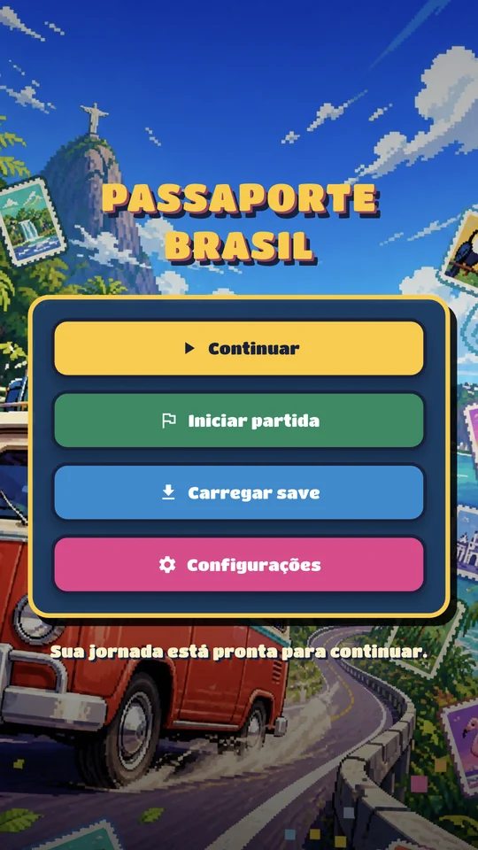
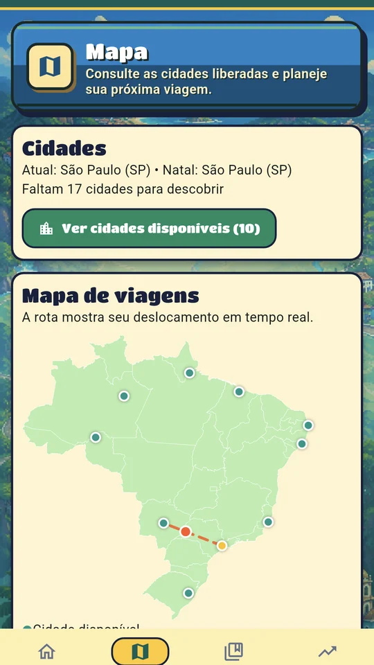
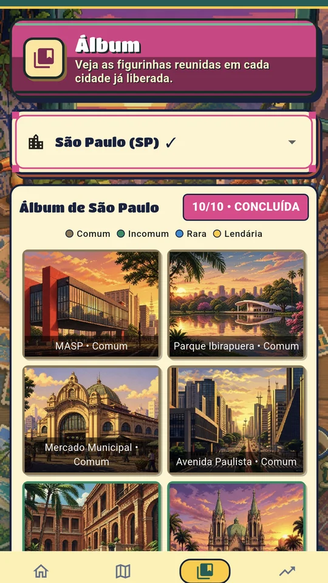
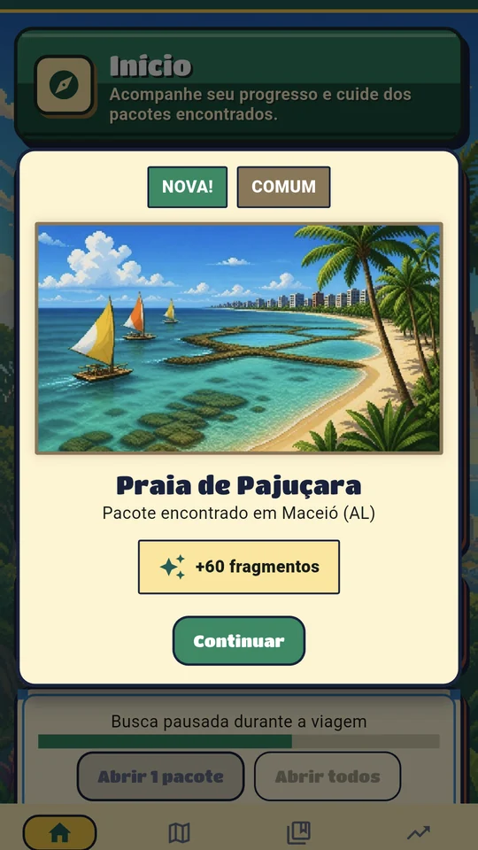

  

  

  
  

## Olá, eu sou o Sidnei 👋

Sou **desenvolvedor back end**, com experiência na construção e manutenção de soluções web, definição de arquitetura e busca de soluções técnicas junto a times de desenvolvimento. Atualmente, atuo na **Greenwave Indústria, Comércio e Serviços**.

Na **SambaTech**, trabalhei por quase três anos como desenvolvedor back end e também assumi a função de **Squad Leader** por dois anos. Nesse período, atuei na gestão do time, organização de prioridades e comunicação entre tecnologia e outras áreas para transformar necessidades de clientes em soluções viáveis.

Além da experiência profissional, desenvolvo produtos autorais. Gosto de acompanhar todo o ciclo de uma ideia: regras de negócio, arquitetura, interface, testes, documentação e distribuição.

## Experiência em resumo

| Período | Atuação |
| :--- | :--- |
| **2025 — atual** | Desenvolvedor Back End na **Greenwave** |
| **2022 — 2024** | **Squad Leader** na SambaTech: gestão do time, prioridades e integração entre áreas |
| **2021 — 2024** | Desenvolvedor Back End na **SambaTech**: soluções web, manutenção e arquitetura de projetos |

## Formação

- 💻 **Desenvolvimento Web Full Stack** — Trybe, formação intensiva com mais de 1.500 horas
- 📚 Formação prática em front end, back end, ciência da computação, engenharia de software e metodologias ágeis

## Tecnologias e ferramentas

  

## Projetos em destaque

### Passaporte Brasil: Figurinhas 🇧🇷

Meu principal projeto atual é um jogo mobile de coleção e viagens pelo Brasil. O jogador percorre as capitais, abre pacotes e completa um álbum com **270 figurinhas de 27 cidades**.

O projeto reúne arquitetura offline, progressão e economia de jogo, saves versionados, recuperação de partidas, notificações, áudio, acessibilidade e uma suíte com mais de 120 testes.

  
  
  
  

